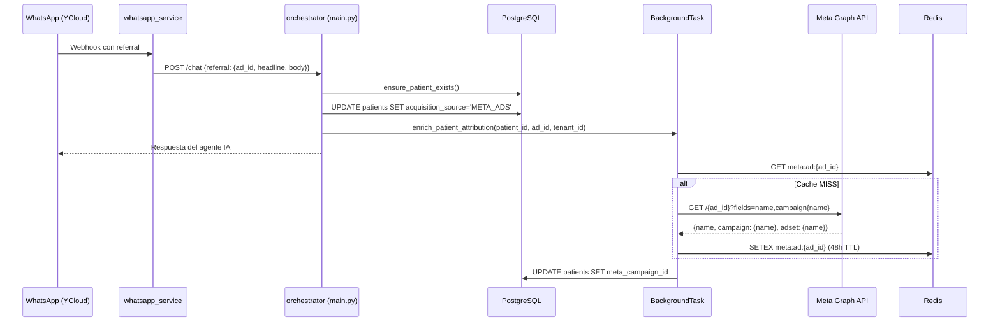

# Integración Meta Ads — Documentación Backend

> Fecha: 2026-02-16 | Versión: 1.0 | Specs: 01–12

---

## 1. Arquitectura General

```
YCloud Webhook → whatsapp_service → orchestrator_service/main.py (/chat)
                                         ├── Atribución First Touch (Spec 03)
                                         ├── Enriquecimiento Async (Spec 05)
                                         │     ├── Redis Cache (48h TTL)
                                         │     └── Meta Graph API
                                          ├── IA Contextual (Spec 06)
                                          └── routes/marketing.py
                                                ├── GET /admin/marketing/stats (Spec 07)
                                                ├── GET /admin/patients/phone/{phone}/context
                                                └── GET /admin/health/integrations (Spec 12)
```

---

## 2. Archivos Nuevos

| Archivo | Spec | Descripción |
|---------|------|-------------|
| `services/meta_ads_service.py` | 04 | Cliente async para Meta Graph API (`MetaAdsClient`) |
| `services/tasks.py` | 05 | Background task: Redis cache + enriquecimiento de `meta_campaign_id` |
| `core/log_sanitizer.py` | 11 | Filtro `SensitiveDataFilter` para ofuscar tokens/PII en logs |
| `scripts/check_meta_health.py` | 12 | Health check de Meta Ads (CLI + módulo para endpoint) |
| `scripts/__init__.py` | — | Package init para directorio scripts |

---

## 3. Archivos Modificados

### 3.1. `main.py`

#### Spec 03 — Atribución First Touch (líneas ~1537-1573)
- Modelo `ChatRequest` extendido con campo `referral: Optional[Dict[str, Any]]`
- En `POST /chat`: si `req.referral` contiene `ad_id`, `headline`, `body`, se registra como "First Touch"
- **Condición**: Solo si `acquisition_source` es `None` o `ORGANIC` (no sobrescribe atribuciones previas)
- **SQL**: `UPDATE patients SET acquisition_source, meta_ad_id, meta_ad_headline, meta_ad_body WHERE id = $5 AND tenant_id = $6`
- Dispara `enrich_patient_attribution()` como `BackgroundTask`

#### Spec 06 — IA Contextual (líneas ~840-850, ~1657-1677)
- **`triage_urgency()`**: Lee `meta_ad_headline` del paciente. Si contiene keywords de urgencia Y el triage es `emergency`/`high`, marca `ad_intent_match=True` y emite vía Socket.IO
- **`build_system_prompt()`**: Inyecta directivas de urgencia en el prompt del agente si el paciente viene de un anuncio con keywords de urgencia

#### Spec 11 — Log Sanitizer (líneas 42-43)
- `install_log_sanitizer()` llamado después de `logging.basicConfig()`

### 3.2. `admin_routes.py`

#### Spec 07 — `GET /admin/marketing/stats`
- Agrega `GROUP BY meta_campaign_id, meta_ad_id, meta_ad_headline` con `LEFT JOIN appointments`
- Retorna `{ campaigns: [...], summary: { total_leads, total_appointments, overall_conversion_rate } }`
- **Soberanía**: `WHERE p.tenant_id = $1 AND p.acquisition_source = 'META_ADS'`
- **Roles**: Solo `ceo`, `secretary`

#### Spec 12 — `GET /admin/health/integrations`
- Import lazy de `scripts.check_meta_health.check_meta_health`
- Retorna `JSONResponse` con status 200 (ok) o 503 (error)
- **Roles**: Solo `ceo`, `secretary`

#### Context Endpoint (mejora)
- `GET /admin/patients/phone/{phone}/context`: SELECT ampliado con `acquisition_source, meta_ad_id, meta_ad_headline, meta_ad_body`

### 3.3. `services/tasks.py`

#### Spec 05 — Enriquecimiento Asíncrono
1. Check Redis → `meta:ad:{ad_id}` (TTL: 48h)
2. Si miss → `MetaAdsClient.get_ad_details(ad_id)`
3. Guardar en Redis
4. `UPDATE patients SET meta_campaign_id = COALESCE($1, ...) WHERE id = $2 AND tenant_id = $3`
- **Importante**: NO sobrescribe `meta_ad_headline` ni `meta_ad_body` (esos vienen del webhook referral y son la fuente primaria)
- Degradación grácil: `MetaAuthError`, `MetaNotFoundError`, `MetaRateLimitError` se capturan sin propagar

### 3.4. `services/meta_ads_service.py`

#### Spec 04 — Meta Graph API Client
- `MetaAdsClient.get_ad_details(ad_id)` → `{ad_id, ad_name, campaign_name, adset_name}`
- Excepciones tipadas: `MetaAuthError` (401), `MetaRateLimitError` (429), `MetaNotFoundError` (404)
- Timeout configurable: `META_API_TIMEOUT` (default: 5s)

### 3.5. `core/log_sanitizer.py`

#### Spec 11 — Sanitización de Logs
- **5 patrones regex** que ofuscan:
  - `access_token=xxx` → `access_token=[REDACTED]`
  - `META_ADS_TOKEN: xxx` → `META_ADS_TOKEN: [REDACTED]`
  - `Authorization: Bearer xxx` → `Authorization: Bearer [REDACTED]`
  - JSON `"token": "xxx"` → `"token": "[REDACTED]"`
  - key=value: `fernet_key=xxx` → `fernet_key=[REDACTED]`

---

## 4. Variables de Entorno Requeridas

| Variable | Tipo | Default | Obligatoria |
|----------|------|---------|-------------|
| `META_ADS_TOKEN` | string | — | ⚠️ Solo si se usa enrichment |
| `META_GRAPH_API_VERSION` | string | `v21.0` | No |
| `META_API_TIMEOUT` | float | `5.0` | No |
| `META_CACHE_TTL` | int (segundos) | `172800` (48h) | No |
| `REDIS_URL` | string | — | ⚠️ Solo si se usa cache |

---

## 5. Flujo de Datos Completo



---

## 6. Seguridad

### Soberanía (tenant_id)
- ✅ `marketing/stats`: `WHERE p.tenant_id = $1`
- ✅ Atribución: `WHERE id = $5 AND tenant_id = $6`
- ✅ Enrichment: `WHERE id = $2 AND tenant_id = $3`
- ✅ Context endpoint: `WHERE tenant_id = $1`
- ✅ Health check: Protegido con `verify_admin_token`

### Sanitización de Logs
- ✅ `SensitiveDataFilter` instalado en root logger
- ✅ Filtra `msg` y `args` de cada `LogRecord`
